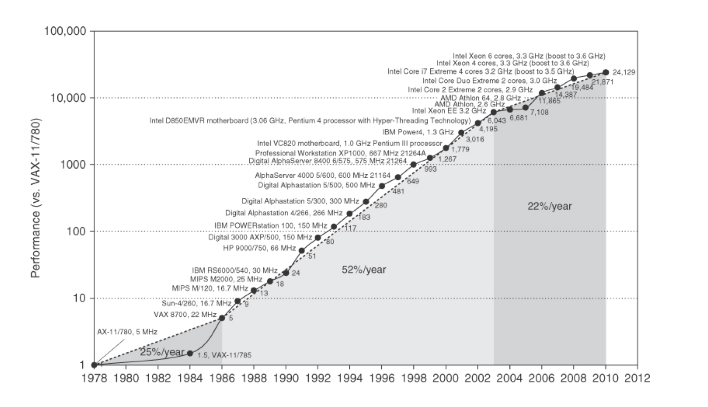
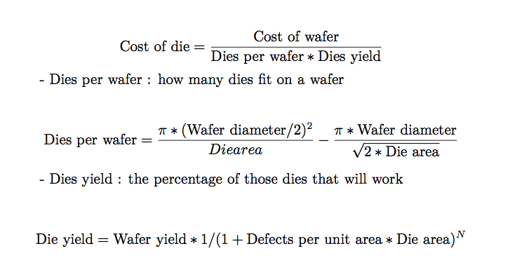
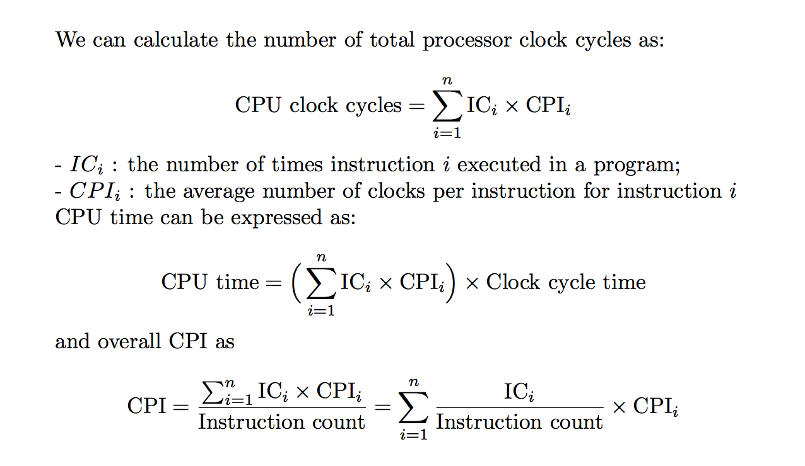

# Summary on Chapter1

## Introduction

> This text is about the architecture ideas and accompanying compiler improvements that made the incredible growth rate possible in the last century, the reasons for the dramatic change, and the challenges and initial promising approaches to architecture ideas, compilers, and interpreters for the 21st century. At the core is a quantitative approach to computer design and analysis that uses empirical observersions of programs, experimentation, and simulation as its tools.

The figure above shows that the combination of architectural and organizational enhancements led to 17 years of sustained growth in performance at an annual rate of over 50% from 1986 to 2003. And the effect of this dramatic growth rate has been fourfold.

- enhanced the capability available to computer users;
- new classed of computers;
- the dominance of microprocessor-based computers across the entire range of computer design;
- software development, trade performance for productivity.

Since 2003, single-processor performance improvement has dropped to less than 22% per year, due to two reasons:

1. how to deal with power dissipation of aircooled chips;
2. the lack of more instruction-level parallelism to exploit efficiently.

> Indeed, in 2004 Intel canceled its high-performance uniprocessor projects and joined others in declaring that the road to high performance would be via **multiple processors per chip** rather than via faster uniprocessor.

为了获得更高性能的处理器，应当提高一个芯片上集成的核心数目，而不是加快单核处理器的速度。

Now that, we must switch from relying solely on instruction-level parallelism (ILP) to data-level parallelism (DLP) and thread-level parallelism (TLP), and also warehouse-scale computers and request-level parallelism (RLP).

- implicitly parallel: ILP;
- explicitly parallel: DLP, TLP, RLP.

## Classes of Computers

five different computing markets, each characterized by different applications, requirements, and computing technologies.

- personal mobile device (PMD);
- desktop;
- server;
- clusters/warehouse-scale computer;
- embedded.

### Classed of Parallelism and Parallel Architectures

Two kinds of parallelism in applications:

1. Data-Level Parallelism (DLP) -- many data items that can be operated on at the same time;
2. Task-Level Parallelism (TLP) -- tasks can operate independently and largely in parallel.

Computer hardware in turn can exploit these two kinds of application parallelism in four major ways:

1. Instruction-Level Parallelism;
2. Vector Architectures and Graphic Processor Units (GPUs);
3. Thread-Level Parallelism;
4. Request-Level Parallelism.

Flynn's Classification (富林分类法)

- Single instruction stream, single data stream (SISD);
- Single instruction stream, multiple data stream (SIMD);
- Multiple instruction stream, single instruction stream (MISD);
- Multiple instruction stream, multiple instruction stream (MIMD).

## Defining Computer Architecture

Some terms:

- **Instruction Set Architecture** (ISA, 指令集体系结构)

  refers to the actual programmer-visible instruction set in this book, serving as the boundary between the software and hardware.

  the seven dimensions of an ISA:

  1. Class of ISA (ISA分类)

     - register-memory ISAs, many instructions can access memory;
     - load-store ISAs, only load or store instructions can access memory.(All recent ISAs are load-store)

  2. Memory addressing (存储器寻址) 字节寻址
  3. Addressing modes (寻址模式)

     立即数寻址、寄存器直接寻址、寄存器间接寻址、基址寻址、变址寻址、etc...

  4. Types and sizes of operands (操作数的类型及大小)

     8-bit (ASCII characterizer), 16-bit (Unicode characterizer or half world), 32-bit (integer or word), 64-bit (double word or long integer), and IEEE 754 floating point in 32-bit (sigle precision) and 64-bit (double precision)

  5. Operations (操作指令)

     data transfer, arithmetic logical, control, and floating point

  6. Control flow instructions (控制语句)

     conditional branches, unconditional jumps, procedure calls, and returns

  7. Encoding an ISA (ISA的编码)

     fixed length and variable length

- **Organization** or **microarchitecture** (组成或微体系结构)

  includes the high-level aspects of a computer's design, such as the memory system, the memory interconnect, and the design of the internal processor or CPU. The term microarchitecture is also used instead of organization.

  Example: two processors with the same instruction set architectures but different organizations are the AMD Opteron and the Intel Core i7, both processors implement th x86 instruction set, but they have very different pipeline and cache organizations.

  two synonyms

  1. use the term *core* instead of *processor*
  2. use the term *multicore* instead of *multiprocessor microprocessor*

- **Hardware** (硬件)

  refers to the specifics of a computer, including the detailed logic design and the packaging technology of the computer. Often a line of computers (系列机) contains computers with identical instruction set architectures and nearly identical organizations, but they differ in the detailed hardware implementation.

- **Computer Architecture** covers all three aspects of computer design -- instruction set architecture (ISA), organization or microarchitecture, and hardware.

## Trends in Technology

Five rapid changes in implementation technology:

- Integrated circuit logic technology: Moore's law
- Semiconductor DRAM: the rate slow down
- Semiconductor Flash:
- Magnetic disk technology
- Network technology

### Performance Trends: Bandwidth over Latency

- *bandwidth* or *throughput* is the total amount of work done in a given time;
- *latency* or *response time* is the time between the start and the completion of an event;
- bandwidth has outpaced latency across these technologies and will likely continue to do so.

### Scaling of Transistor Performance and Wires

- feature size: the minimum size of a transistor or a wire in either the x or y dimension.

- Since the transistor count per square millimeter of silicon is determined by the surface area of a transistor, the density of transistors increases quadratically with a linear decrease in feature size. (由于每平方毫米硅片上的晶体管数目是由单个晶体管的表面积大小所决定的，所以当特征尺寸线性下降时，晶体管密度将以平方曲线上升。)

- Transistor performance improves linearly with decreasing feature size.

## Trends in Power and Energy in Integrated Circuits

Power is the biggest challenge facing the computer designer for nearly every class of computer.

### Power and Energy: A Systems Perspective

From the viewpoint of a system designer, there are three primary concerns about performance, power, and energy.

1. provide enough power to ensure orrect operation
2. sustained power consumption
   thermal design power (TDP), cooling system,
3. energy and energy efficiency

   > Which metric is the right one for comparing prodessors: energy or power?
   >
   > In general, energy is always a better metric because it is tied to a specific task and the time required for that task.
   >
   > If we want to know which of two prodessors is more efficient for a given task, we should compare energy comsumption (not power) for executing the task.

### Energy and Power within a Microprocessor

- dynamic energy

  Energy_dynamic ∝ Capacitive load * square(Voltage)

- the logic transition of 0 -> 1 -> 0 or 1 -> 0 -> 1

  Energy_dynamic ∝ 1/2 * Capacitive load * square(Voltage)

- dynamic power

  Power_dynamic ∝ 1/2 * Capacitive load * square(Voltage) * Frequency switched

- For a fixed task, slowing clock rate reduces power, but not energy.

- As we move from one process to the next, the increase in the number of transistors switching and the frequency with which they switch dominate the decrease in load capacitance and voltage, leading to an overall growth in power consumption and energy. (当我们从一种制造工艺转向另一种工艺时，晶体管的开关次数以及其开关频率的增高强于负载电容和电压的下降，从而导致功耗和能耗的总体上升。)

- Power is now the major constraint to using transistors. Hence, modern microprocessors offer many techniques to try to improve enery efficiency despite flat clock rates and constant supply voltages:

  1. Do nothing well (以逸待劳)
  2. Dynamic Voltage-Frequency Scaling (DVFS, 动态电压-频率调整)
  3. Design for typical case (针对典型情景的设计)
  4. Overclocking (超频)

- Static power

  Power_static ∝ Current_static * Voltage

  static power is proportional to number of devices, the only hope to stop leakage is to turn off power to subsets of the chips.

- The importance of power and energy has increased the scrutiny on the efficiency of an innovation, so the primary evaluation now is tasks per joule or performance per watt as opposed to performance per mm^2 of solicon. (由于功率和能耗的重要性，人们在评价一项创新时，更加重视对其效率的审核。因此，现在的主要评价指标是每焦耳完成的任务数或者每瓦特实现的性能，而不再是每平方毫米的硅所实现的性能。)

## Trends in Cost

> An understanding of cost and its factor is essential for computer architects to make intelligent decisions about whether or not a new feature should be included in designs where cost is an issue.

disscuss the major factors that influence the cost of a computer and how these factors are changing over time

### The Impact of Time, Volume, and Commoditization

- Time (时间)

  - learning curve (学习曲线) -- manufacturing costs decrease over time (制造成本随着时间的推移而降低)
  - yield (成品率) -- the percentage of manufactured devices that survives the testing procedure (指成功通过测试程序的器件占所生产器件总数的百分比)

- Volume (产量)

  Increasing volumes affect cost in several ways:
  - decrease the time needed to get down the learning curve;
  - increase purchasing and manufacturing efficiency.

- Commoditization (商品化、大众化)

### Cost of an Integrated Circuits

- A wafer (晶圆) is still tested and chopped into dies (晶片) that are packaged. (对晶圆进行测试，切割成晶片进行封装)

- The cost of dies:

## Dependability (without)

## Measuring, Reporting, and Summarizing Performance

- *response time* or *execution time* -- the time between the start and the completion of an event;
- *throughput* -- the total amount of work done in a given time.

> The only consistent and reliable measure of performance is the execution time of real programs

### Benchmarks (基准测试)

  **SPEC**

## Quantitative Principles of Computer Design

Introduce important observations about design, as well as two equations to evaluate alternatives.

### Take Advantage of Parallelism

- at the system level

  data-level parallelism, request-level parallelism, thread-level parallelism

- at the level of an individual processor

  instruction-level parallelism, eg. pipelining

- at the level of detailed digital design

  data-level parallelism, eg. set-associative caches (组相联缓存), modern ALUs use carry-lookhead (先行进位)

### Principle of Locality

  *principle of locality*: programs tend to reuse data and instructions they have used recently (程序常常重复使用它们最近刚用过的数据和指令)

  - We can predict with reasonable accuracy what instructions and data a program will use in the near future based on its accesses in the recent past.

  - two different types of locality (局部性原理分为两种)

    1. temporal locality (时间局部性原理) -- recently accessed items are likely to be accessed in the near future;
    2. spatial locality (空间局部性原理) -- items whose addresss are near one another tend to be referenced close together in time.

### Focus on the Common Case

  - in making a design trade-off, favor the frequent case over the infrequent case;
  - the common case works for power as well as for resource allocation and performance;
  - the frequent case is often simpler and can be done faster than the infrequent case.

### Amdahl's law

  defines the *speedup* (加速比) that can be gained by using a particular feature

  Speedup = (Performance for entire task using the enhancement when possible) / (Performance for entire task without using the enhancement)

  Alternatively,

  Speedup = (Execution time for entire task without using the enhancement) / (Execution time for entire task using the enhancement when possible)

  Speedup tels us how much faster a task will run using the computer with the enhancement as opposed to the original computer.

### The Processor Performance Equation

  CPU time = CPU clock cycles for a program * 、

  CPI = (CPU clock cycles for a program) / IC

  CPU time = IC * CPI * Clock cycle time

  - Clock cycle time, 时钟周期;
  - IC (instruction count) -- the number of instructions executed, 执行的指令数目;
  - CPI (clock cycles per instruction) -- the average number of clock cycles per instruction, 平均执行一条指令所用的始终周期数.

  - for each individual instruction:

  

## Putting It All Together: Performance, Price, and Power

## Fallacies and Pitfalls

to explain some commonly held misbeliefs or misconception that we should avoid

- ***Fallacies***, misbeliefs (give a counterexample)

  1. Multiprocessor are a silver bullet.
  2. Hardware enhancements that increase performance improve energy efficiency are at worst energy neutral.
  3. Benchmarks remain valid indefinitely.
  4. The rated mean time to failure of disk is 1,200,000 hours or almost 140 years, so disks practically never fail.
  5. Peak performance tracks observed performance.

- ***Pitfalls***, are generalizations of principles that are true in a limited context, easily made mistakes

  1. Falling prey to Amdahl's heartbreaking law.
  2. A single point of failure.
  3. Fault detection can lower availability.
