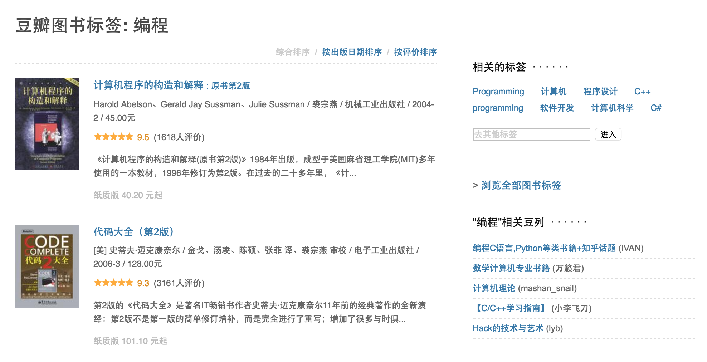

# How to find a book to read & track & continue

> - [ ] 为什么要整理这样的一个读书笔记？
>
> - [ ] 整理自己是如何找到自己专业的书籍来看的
>
> - [ ] 如何记录自己看书的心得体会？
>
> - [ ] 如何利用 `github` 进行跟踪自己的看书情况？

之前在读本科的时候，我找书看都是上豆瓣，查看“编程”类标签

冲着这个名气（其实就是附庸风雅，觉得买几本这个书放在书架上也很是不错），也就买了好几本这个页面上的书，[计算机程序的构造和解释](https://book.douban.com/subject/1148282/)、[深入理解计算机系统](https://book.douban.com/subject/1230413/)、[算法导论](https://book.douban.com/subject/1885170/)、[C程序设计语言](https://book.douban.com/subject/1139336/)、[算法](https://book.douban.com/subject/19952400/)。说出来也不怕笑话，上面的书大都是在本科二年级时候就已经买了，闲置在书架上柜子上已经蒙了几层灰了，但就是没怎么想起来看，`SCIP` 也是在今年本科毕业之后才开始看的，一个月断断续续看到了第二章，其他的就更不用说了，都没怎么系统的看完，这个翻一翻，那个摘一段看看。遂觉得自己耽误了好多时间，突又想起来，“种一棵树的时间，是10年前，或者就是现在。”也就能勉做安慰了（怎么感觉就是自己在给自己找各种各样的借口？）。

在一个星期以前，在网上看到一篇文章[如何用Github去管理你的Idea](https://zhuanlan.zhihu.com/p/20442311)，就想着自己也可以去弄一个这样的整理 `Idea` 的 `git` 库，确实也仿照着[出来](https://github.com/qiaoIn/ideas)了。自己也更进一步，使用 `github` 来对自己的读书学习进度与深度进行管理，例如，如何使用 `GitHub` 特殊的语法特性 `markdown flavor` 去检查计划的进展，包括使用任务列表，这个是借鉴的[这篇文章](https://zhuanlan.zhihu.com/p/22881223)中“如何使用它”部分；如何使用 'Issues' 来管理自己将来想要去做（看书，或者网上 `MOOC`）和正在做的事情，当然这是后话。

此之为开始。
